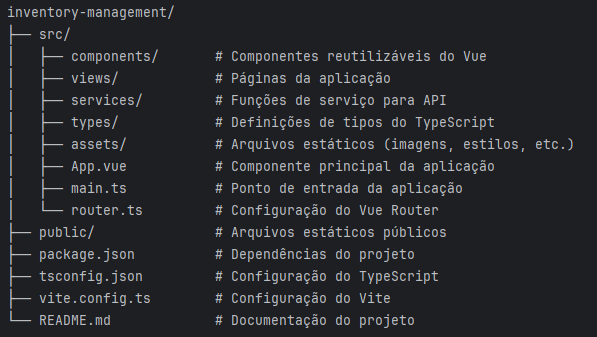

# Vue 3 + TypeScript + Vite

# Frontend de Gestão de Estoque

## Visão Geral

Este projeto é uma aplicação frontend para gestão de estoque, construída utilizando **Vue 3**, **TypeScript** e **Vite**. Ele fornece uma interface intuitiva para gerenciar produtos, acompanhar movimentações e gerar relatórios de lucro. A aplicação integra-se com uma API backend desenvolvida em **Java** usando **Spring Boot**.

## Funcionalidades

- **Gestão de Produtos**: Adicionar, editar, excluir e listar produtos.
- **Acompanhamento de Movimentações**: Monitorar movimentações de estoque.
- **Relatórios de Lucro**: Gerar e visualizar relatórios de lucro com filtros de data.
- **Design Responsivo**: Otimizado para dispositivos desktop e móveis.
- **UI Moderna**: Construída com **Element Plus** para um visual limpo e profissional.

## Tecnologias Utilizadas

### Frontend
- **Vue 3**: Framework JavaScript progressivo para construção de interfaces de usuário.
- **TypeScript**: Linguagem de programação fortemente tipada para melhor qualidade de código.
- **Vite**: Ferramenta de build rápida para aplicações web modernas.
- **Element Plus**: Biblioteca de UI para Vue 3.
- **Axios**: Cliente HTTP para comunicação com APIs.

### Backend
- **Java**: Linguagem de programação para o backend.
- **Spring Boot**: Framework para construção de APIs RESTful.
- **Maven**: Gerenciador de dependências.

## Estrutura do Projeto



## Documentação do Projeto

## Instalação

### Pré-requisitos
- **Node.js** (v16 ou superior)
- **npm** (v8 ou superior)

### Passos
1. Clone o repositório:
   ```bash
   git clone https://github.com/your-username/inventory-management.git
   cd inventory-management

Instale as dependências:  
npm install
Inicie o servidor de desenvolvimento:  
npm run dev
Abra a aplicação no navegador em http://localhost:3000.  
Scripts
npm run dev: Inicia o servidor de desenvolvimento.
npm run build: Gera a aplicação para produção.
npm run preview: Faz uma pré-visualização da build de produção localmente.
npm run lint: Executa verificações de linting.
Integração com API
O frontend comunica-se com a API backend hospedada em http://localhost:8080/api. Abaixo estão os principais endpoints utilizados:  
GET /product: Lista produtos com paginação.
GET /product/all: Lista todos os produtos sem paginação.
POST /product: Salva um novo produto.
PUT /product/{id}: Edita um produto existente.
DELETE /product/{id}: Exclui um produto.
GET /product/lucro: Busca relatórios de lucro paginados.
Personalização
Variáveis de Ambiente
Você pode configurar a URL base da API criando um arquivo .env na raiz do projeto:

VITE_API_BASE_URL=http://localhost:8080/api

Estilização
A aplicação utiliza estilos escopados e variáveis globais de CSS para personalização. Você pode modificar os estilos no arquivo App.vue ou nos componentes individuais.  
Contribuição
Faça um fork do repositório.
Crie uma nova branch para sua funcionalidade ou correção de bug.
Commit suas alterações e envie para seu fork.
Submeta um pull request.
Licença
Este projeto está licenciado sob a Licença MIT. Veja o arquivo LICENSE para mais detalhes.
Agradecimentos
Documentação do Vue.js
Documentação do TypeScript
Documentação do Element Plus
Documentação do Vite