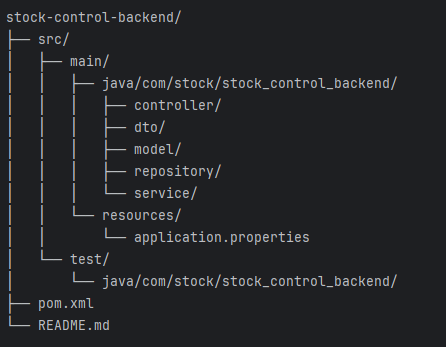

# Stock Control Backend

Backend para gerenciamento de estoque, desenvolvido em Java com Spring Boot. Fornece endpoints REST para cadastro, consulta, atualização, exclusão de produtos, além de relatórios de lucro e filtragem por tipo.

## Tecnologias Utilizadas

- Java 17+
- Spring Boot
- Maven
- Spring Data JPA
- Lombok
- Swagger/OpenAPI
- JUnit 5
- Mockito

## Como Executar

1. **Pré-requisitos:**
    - Java 17 ou superior
    - Maven 3.8+
    - Banco de dados configurado (ex: H2, PostgreSQL, MySQL)

2. **Clone o repositório:**
   ```bash
   git clone https://github.com/seu-usuario/seu-repo.git
   cd seu-repo/stock-control-backend

Configure o banco de dados:  
Edite o arquivo src/main/resources/application.properties conforme seu ambiente.
Build e execução:  
mvn clean install
mvn spring-boot:run
Acesse a documentação Swagger:  
http://localhost:8080/swagger-ui.html
Endpoints Principais
Produtos
POST /api/product Cadastra um novo produto.  
GET /api/product Lista produtos paginados. Parâmetros: page, size.  
GET /api/product/detalhar/{id} Detalha um produto pelo ID.  
PUT /api/product/{id} Atualiza um produto.  
DELETE /api/product/{id} Remove um produto.  
GET /api/product/tipo/{tipo} Lista produtos por tipo (ELECTRONICS, FOOD, etc).  
GET /api/product/all Lista todos os produtos (sem paginação).  
Lucro
GET /api/product/lucro Lista paginada de produtos com lucro. Parâmetros opcionais: startDate, endDate.  
GET /api/product/{id}/lucro Detalha o lucro de um produto por ID, com filtro opcional de datas.
Estrutura do Projeto



Testes
Os testes unitários estão em src/test/java/com/stock/stock_control_backend/.
Para rodar os testes:
mvn test
Contribuição
Fork este repositório
Crie uma branch: git checkout -b minha-feature
Commit suas alterações: git commit -m 'feat: minha nova feature'
Push para a branch: git push origin minha-feature
Abra um Pull Request
Licença
Este projeto está sob a licença MIT.  <hr></hr> Desenvolvido por Filipe Silva

Edite os campos de usuário, banco e links conforme necessário para o seu projeto.